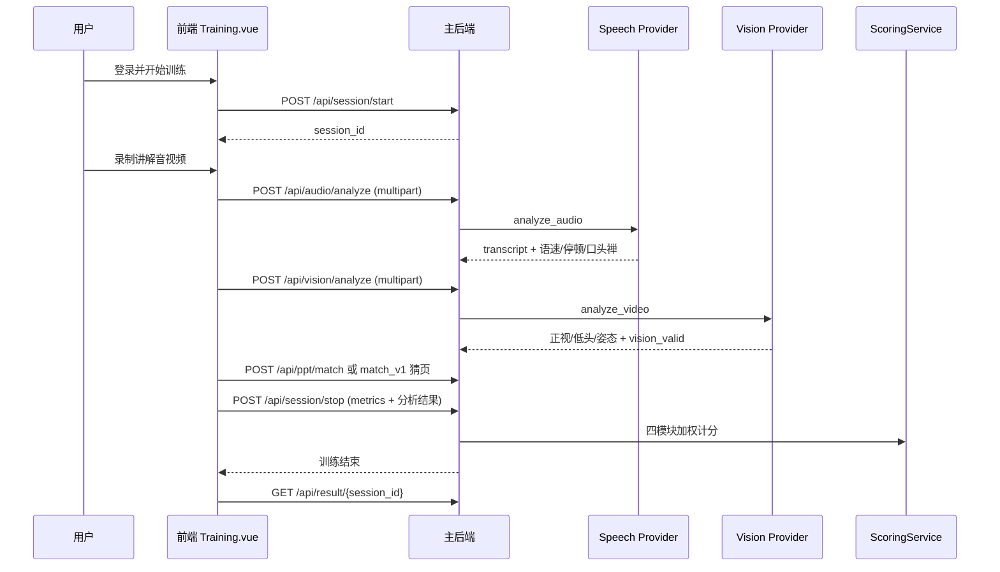
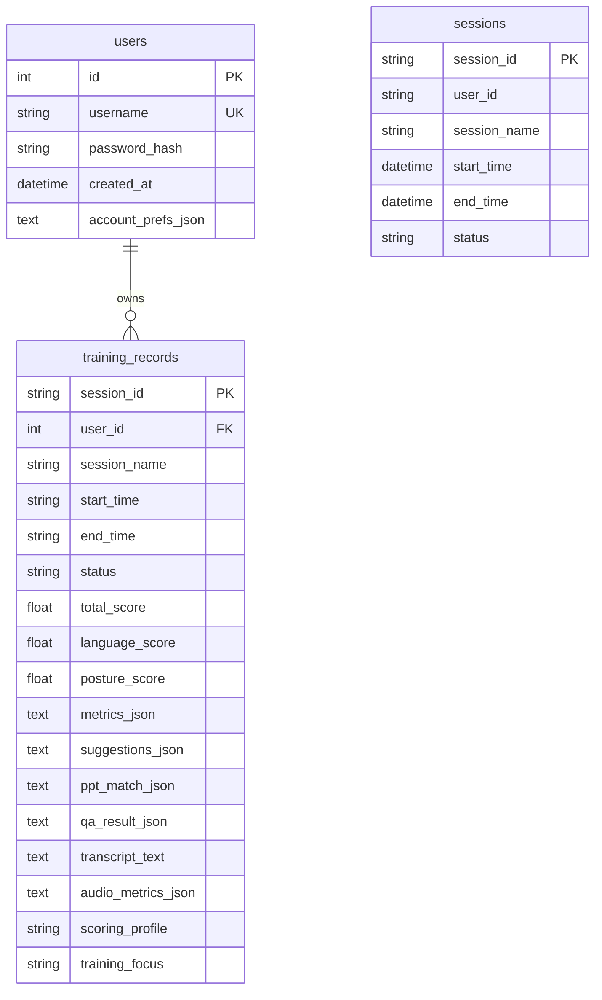

# 答见 AI 教练系统设计文档

**项目名称**：答见 AI 教练——基于昇腾 AI 开发板的智能演讲与答辩训练系统  
**文档版本**：V1.0（与当前仓库代码对齐）  
**适用对象**：比赛评审、指导教师、后续维护开发者  

---

## 1. 文档概述

### 1.1 文档目的

本文档描述「答见 AI 教练」在**当前仓库已实现代码**基础上的系统架构、模块划分、接口契约、数据模型、AI 能力、昇腾开发板接入方式、部署步骤与验收标准，供比赛材料归档与工程交接使用。

### 1.2 项目范围（当前版本）

| 能力 | 实现状态 |
|------|----------|
| 用户注册/登录（JWT） | 已完成 |
| PPT 上传与 `.pptx` 解析 | 已完成 |
| 演讲训练（浏览器采集音视频） | 已完成 |
| 语音分析（本地 Whisper / 可选板侧 ASR） | 已完成（默认 `SPEECH_PROVIDER=local`） |
| 视觉分析（本地 OpenCV+MediaPipe / 板侧 ascend_service） | 已完成 |
| PPT 内容匹配与自动猜页 | 已完成 |
| 问答模拟（规则生成与评估） | 当前版本采用规则问答作为稳定实现 |
| 追问链（`/api/qa/followup`） | 已完成（默认 `FOLLOWUP_PROVIDER=rule`；model/hybrid 为可配置扩展） |
| 多维度评分与训练报告 | 已完成（`ScoringService` 四模块加权） |
| 训练历史与档案摘要 | 已完成（SQLite + 内存缓存） |
| 昇腾边缘视觉服务 | 已完成（`ascend_service`，比赛推荐路径） |

**不在当前稳定主流程内的能力**（架构已预留，勿按“已量产”理解）：`PPT_PROVIDER=ascend`、`QA_PROVIDER=ascend`、Docker 一键部署、PDF 报告导出、多租户 SaaS。

### 1.3 代码仓库关键路径

```
dajian-ai-coach/
├── backend/                 # 主后端 FastAPI
├── frontend/                # Vue 3 前端
├── ascend_service/          # 昇腾/板侧边缘服务
├── docs/                    # 设计与部署文档
├── scripts/                 # 板侧启动与冒烟脚本
└── README.md
```

数据库文件：`backend/data/dajian.db`（SQLite，启动时自动建表/迁移）。

---

## 2. 项目背景

### 2.1 传统答辩/演讲训练的痛点

- **反馈滞后且主观**：缺少可量化的语速、停顿、眼神、姿态指标。  
- **评估维度单一**：多数练习仅关注“是否背完”，缺少内容与问答维度。  
- **难以模拟追问**：真实答辩的连环追问需要教师反复陪练，成本高。  
- **隐私顾虑**：完整答辩视频上传公有云存在泄露风险。

### 2.2 本项目目标

- 构建 **PPT → 训练 → 分析 → 问答 → 报告** 的闭环。  
- 语音、视觉、PPT、问答通过 **Provider 架构** 解耦，可在本机 CPU 与昇腾开发板之间切换。  
- 比赛演示推荐：**PC 跑主业务，开发板仅承担视觉推理**（见 `docs/ascend_deployment_v1.md`）。  
- 降低训练成本，提升答辩准备效率；报告用于指出**下一次该改什么**，而非简单贴标签。

---

## 3. 系统总体架构

系统采用三层结构：**前端 Web 应用层**、**主后端服务层**、**昇腾边缘服务层**。

```mermaid
flowchart TB
    subgraph Client["用户侧"]
        U[用户浏览器]
    end

    subgraph FE["前端 Vue 3 应用 :5173"]
        Pages[Training / Result / Report / History]
        API[api/base.js 统一请求]
    end

    subgraph BE["主后端 FastAPI :8000"]
        Auth[api/auth JWT]
        Session[api/session 会话编排]
        Audio[api/audio 语音]
        Vision[api/vision 视觉]
        PPT[api/ppt 课件]
        QA[api/qa 问答]
        Score[services/scoring_service 评分]
        Report[services/report_service 报告]
        PF[factories/provider_factory]
        GW[gateways/ascend_gateway/http_gateway]
        DB[(SQLite backend/data/dajian.db)]
        Mem[(内存 mock_store: sessions/results/ppt_store)]
    end

    subgraph Edge["昇腾边缘 ascend_service :18081"]
        H[/health]
        VA[/vision/analyze]
        VS[services/vision_service OpenCV+MediaPipe/Haar]
    end

    U --> Pages
    Pages --> API
    API --> Auth
    API --> Session
    API --> Audio
    API --> Vision
    API --> PPT
    API --> QA
    Session --> Score
    Session --> Report
    Session --> DB
    Session --> Mem
    PPT --> Mem
    Audio --> PF
    Vision --> PF
    PF --> GW
    GW -->|multipart HTTP| VA
    VA --> VS
    PF -->|VISION_PROVIDER=local| VisionLocal[services/vision_service 本机]
```

### 3.1 各层职责

| 层级 | 技术 | 职责 |
|------|------|------|
| 前端 | Vue 3 + Vite + Element Plus + ECharts | 登录、训练录制、结果/报告/历史展示；所有 AI 请求经主后端 |
| 主后端 | FastAPI + SQLAlchemy + SQLite | 业务编排、评分、持久化、Provider 调度、昇腾网关转发 |
| 边缘端 | FastAPI + OpenCV + MediaPipe（或 Haar fallback） | 板侧视觉分析与健康检查；可选板侧 ASR |

> **说明**：前端当前为 **JavaScript**（`frontend/src/main.js`），非 TypeScript；依赖以 `frontend/package.json` 为准。

---

## 4. 核心业务流程

### 4.1 PPT 上传与解析

1. 用户在训练页上传 `.pptx`（仅支持该格式，见 `backend/api/ppt.py`）。  
2. `POST /api/ppt/upload` 保存文件至 `backend/data/uploads/`，调用 `LocalPPTProvider.parse_ppt()`。  
3. 返回 `ppt_id` 与 `pages[]`（含 `page_index`、`title`、`keywords`）；可选附加 `document`（文档理解增强结构）。  
4. 解析结果写入内存 `ppt_store[ppt_id]`（**进程重启后需重新上传**，或通过 `ppt_text_data` 在 stop 时兜底）。

### 4.2 演讲训练流程



### 4.3 问答模拟流程

1. `POST /api/qa/generate`：基于 `ppt_store` 中页面或 `document` 生成首问（`QUESTION_PROVIDER=rule` 默认）。  
2. 用户文本或语音作答；语音经 `/api/audio/analyze?analysis_phase=qa_answer` 转写。  
3. `POST /api/qa/evaluate`：`LocalRuleQAProvider` 返回 `coverage_score`、`is_relevant`、关键词命中等。  
4. 可选 `POST /api/qa/followup`：基于 `qa_result` 弱点生成追问（默认规则 V2；`FOLLOWUP_PROVIDER=model|hybrid` 可接 OpenAI 兼容接口，见 `backend/config.py`）。

### 4.4 报告生成流程

1. `POST /api/session/stop` 调用 `_compose_result_payload()` 汇总评分、建议、教练点评等。  
2. 结果写入内存 `results[session_id]` 与 SQLite `training_records`。  
3. `GET /api/report/{session_id}` 经 `ReportService.build_report()` 输出结构化报告字段。  
4. 前端 `Report.vue` 展示；无效训练（如 `audio_valid=false`）会在历史/结果中标记 `training_valid=false`。

---

## 5. 模块划分

### 5.1 前端模块

| 模块 | 路径 | 职责 |
|------|------|------|
| 路由 | `frontend/src/router/index.js` | `/training`、`/result/:sessionId`、`/report/:sessionId`、`/history` 等；JWT 守卫 |
| API 封装 | `frontend/src/api/base.js` | `getJson/postJson/uploadFile`；`VITE_API_BASE` 可指向后端 |
| 训练页 | `frontend/src/pages/Training.vue` | PPT 上传、录制、问答、提交 stop |
| 结果页 | `frontend/src/pages/Result.vue` | 展示分项得分与指标 |
| 报告页 | `frontend/src/pages/Report.vue` | 调用 `/api/report/{id}` |
| 历史页 | `frontend/src/pages/History.vue` | 训练列表、删除、无效记录清理 |
| 登录注册 | `pages/Login.vue`、`Register.vue` | JWT 存本地 |
| 图表组件 | `components/MetricPanel.vue`、`ScoreCard.vue` | ECharts 指标展示 |
| 布局 | `layouts/AppShell.vue` | 主导航壳 |

### 5.2 后端模块

| 模块 | 目录/文件 | 职责 | 输入 | 输出 |
|------|-----------|------|------|------|
| 应用入口 | `backend/app.py` | 注册路由、CORS、启动建库 | — | FastAPI 应用 |
| 配置 | `backend/config.py` | Provider、昇腾 URL、JWT、超时 | 环境变量/`.env` | `settings` |
| 会话 | `backend/api/session.py` | start/stop/resume/abandon | JSON + 用户 JWT | session_id、落库 |
| 结果/历史 | `backend/api/result.py` | 结果查询、历史 CRUD | session_id | 完整 payload |
| 报告 | `backend/api/report.py` | 报告组装 | session_id | report JSON |
| PPT | `backend/api/ppt.py` | upload/parse/match/match_v1 | multipart/JSON | ppt_id、匹配分 |
| 语音 | `backend/api/audio.py` | 音频分析入口 | webm/wav 文件 | transcript、指标 |
| 视觉 | `backend/api/vision.py` | 视频分析入口 | webm/mp4 文件 | 仪态指标 |
| 问答 | `backend/api/qa.py` | generate/evaluate/followup | JSON | 问题/评价/追问 |
| 认证 | `backend/api/auth.py` | register/login/me | 用户名密码 | JWT |
| 档案 | `backend/api/profile.py` | 偏好与训练摘要 | JWT | 聚合统计 |
| 系统 | `backend/api/system.py` | provider-status | — | Provider + 板端探测 |
| Provider 工厂 | `backend/factories/provider_factory.py` | 选择 local/ascend 实现 | 环境变量 | Provider 单例 |
| 昇腾网关 | `backend/gateways/ascend_gateway/http_gateway.py` | multipart 转发 | 本地临时文件 | AscendResponse |
| 适配器 | `backend/adapters/ascend_*_adapter.py` | 板端响应归一化 | 原始 JSON | 业务 dict |
| 评分 | `backend/services/scoring_service.py` | 四模块加权计分 | stop 汇总数据 | total/language/posture/content/qa |
| 报告 | `backend/services/report_service.py` | 报告字段整理 | result_data | report |
| 语音服务 | `backend/services/audio_service.py` | Whisper 转写与指标 | 音频路径 | 指标 dict |
| 视觉服务 | `backend/services/vision_service.py` | MediaPipe 帧分析 | 视频路径 | 仪态 dict |
| 数据库 | `backend/database/db.py` | SQLite 引擎与迁移 | — | SessionLocal |
| 内存存储 | `backend/services/mock_store.py` | sessions/results/ppt_store | — | 进程内 dict |

### 5.3 昇腾边缘服务模块

| 模块 | 路径 | 职责 |
|------|------|------|
| 启动入口 | `ascend_service/app.py` | 挂载 health/speech/vision 路由 |
| 健康检查 | `ascend_service/api/health.py` | `GET /health`，返回 hostname、platform、runtime_label 等 |
| 视觉分析 | `ascend_service/api/vision.py` | `POST /vision/analyze`（multipart `video_file`） |
| 语音分析 | `ascend_service/api/speech.py` | `POST /speech/analyze`（比赛默认可不启用） |
| 视觉算法 | `ascend_service/services/vision_service.py` | OpenCV 读帧 + MediaPipe；无 MediaPipe 时 Haar fallback |
| 协议 | `ascend_service/schemas/protocol.py` | `AscendResponse` 统一包装 |

**与主后端通信**：主后端 `AscendHttpGateway` 通过 `ASCEND_BASE_URL` 发起 HTTP multipart，**前端不直连开发板**。

---

## 6. 技术栈设计

| 层级 | 技术 | 版本/说明 | 用途 |
|------|------|-----------|------|
| 前端 | Vue 3 | ^3.5 | SPA 页面 |
| 前端 | Vite | ^6.0 | 开发与构建 |
| 前端 | Vue Router | ^4.4 | 路由与鉴权 |
| 前端 | Element Plus | ^2.6 | UI 组件 |
| 前端 | ECharts | ^5.5 | 指标图表 |
| 后端 | FastAPI | 0.118.3 | REST API |
| 后端 | Uvicorn | 0.34.2 | ASGI 服务 |
| 后端 | SQLAlchemy | 2.0.40 | ORM |
| 后端 | SQLite | 文件库 | 用户与训练记录 |
| 后端 | PyJWT + bcrypt | — | 登录鉴权 |
| AI 语音 | faster-whisper | requirements 未锁版 | 本地 ASR |
| AI 语音 | pydub、librosa、soundfile | — | 音频预处理 |
| AI 视觉 | mediapipe | 0.10.21（backend） | 人脸/姿态 |
| AI 视觉 | OpenCV | ascend/board 依赖 | 视频解码 |
| 文档 | python-pptx | 0.6.23 | PPTX 解析 |
| 文档 | pypdf | ≥5.0 | PDF 文本层（调试） |
| 边缘 | ascend_service | FastAPI | 板侧视觉/可选语音 |

---

## 7. 接口定义

### 7.1 主后端接口

> 完整 OpenAPI：`http://localhost:8000/docs`（启动 `backend/app.py` 后访问）。

| 方法 | 路径 | 功能 | 请求参数 | 返回结果 | 备注 |
|------|------|------|----------|----------|------|
| GET | `/health` | 轻量健康检查 | 无 | status、providers 摘要 | 含 speech/vision provider |
| GET | `/api/system/provider-status` | Provider 与板端探测 | 无 | speech/vision provider、ascend_health_check | 赛前自检 |
| POST | `/api/auth/register` | 注册 | username、password | access_token、user | JWT |
| POST | `/api/auth/login` | 登录 | username、password | access_token | |
| GET | `/api/auth/me` | 当前用户 | Authorization | id、username | |
| POST | `/api/session/start` | 开始训练 | session_name、scoring_profile、training_focus 等 | session_id、start_time | 需登录 |
| POST | `/api/session/stop` | 结束训练 | session_id、metrics、audio/vision 分析、ppt_match、qa_result 等 | status completed | 核心编排 |
| GET | `/api/session/resume_status` | 中断恢复探测 | session_id | recoverable、reason | |
| POST | `/api/session/abandon` | 放弃活跃会话 | session_id | ok、discarded | |
| POST | `/api/ppt/upload` | 上传 PPT | multipart file | ppt_id、pages[] | 仅 .pptx |
| POST | `/api/ppt/parse` | 解析 PPT 文本 | multipart file | slides、full_text、document | 可不写 ppt_store |
| POST | `/api/ppt/match` | 单页匹配 | ppt_id、page_index、spoken_text | match_score、keywords | |
| POST | `/api/ppt/match_v1` | 自动猜页/TF-IDF | spoken_text 或 transcript+slides | best_page_index 等 | |
| GET | `/api/ppt/status/{ppt_id}` | 调试 ppt_store | ppt_id | exists、page_count | |
| POST | `/api/audio/analyze` | 语音分析 | multipart file；Query: analysis_phase | transcript、speech_rate、audio_valid 等 | 正式 ASR 入口 |
| POST | `/api/vision/analyze` | 视觉分析 | multipart file | forward_gaze_ratio、vision_valid 等 | 经 Provider |
| POST | `/api/qa/generate` | 生成问题 | ppt_id、page_index?、count? | question 或 questions[] | |
| POST | `/api/qa/evaluate` | 评估回答 | question、answer_text、expected_keywords | coverage_score、is_relevant | 规则评估 |
| POST | `/api/qa/followup` | 生成追问 | qa_result、ppt_match 等 | followup_questions[] | |
| GET | `/api/result/{session_id}` | 训练结果 | session_id | total_score、metrics、suggestions | |
| GET | `/api/report/{session_id}` | 训练报告 | session_id | basic_info、scores、conclusion 等 | |
| GET | `/api/history` | 历史列表 | Query: valid_only 等 | history[] | |
| DELETE | `/api/history/{session_id}` | 删除单条 | session_id | ok | |
| POST | `/api/history/clear-invalid` | 清理无效记录 | 无 | cleared_count | |
| GET | `/api/profile/summary` | 档案摘要 | JWT | valid_training_count 等 | |
| GET/PUT | `/api/profile/preferences` | 账号偏好 | JSON | 评分模式、材料模式等 | |
| POST | `/api/document/parse` | 文档理解调试 | multipart | document 结构 | 非训练主路径 |

### 7.2 昇腾边缘服务接口

| 方法 | 路径 | 功能 | 请求参数 | 返回结果 | 备注 |
|------|------|------|----------|----------|------|
| GET | `/health` | 板侧健康检查 | 无 | status、hostname、platform_system、runtime_label、local_ip 等 | PC 通过 provider-status 探测 |
| POST | `/vision/analyze` | 视频视觉分析 | Form: request_id；File: video_file | AscendResponse：result 含 forward_gaze_ratio、downward_head_ratio、posture_stability、vision_valid | 主后端 multipart 转发 |
| POST | `/mock/vision/analyze` | 兼容 mock 路径 | 同上 | 同上 | 与标准路径等价 |
| POST | `/speech/analyze` | 板侧语音分析 | multipart audio_file | AscendResponse + transcript | `SPEECH_PROVIDER=ascend` 时使用 |

**AscendResponse 顶层字段**：`success`、`provider`（如 `ascend-service`）、`request_id`、`result`（dict）、`error`。

### 7.3 后续接口规划（代码中未实现或仅占位）

- `PPT_PROVIDER=ascend`：工厂抛出 `NotImplementedError`。  
- `QA_PROVIDER=ascend`：同上。  
- 报告 PDF 导出、WebSocket 实时反馈：文档/前端有预留思路，无独立 API。

---

## 8. 数据结构设计

### 8.1 训练会话（SessionStop 提交与结果沉淀）

| 字段 | 类型 | 含义 | 示例 |
|------|------|------|------|
| session_id | string | 会话 UUID | `"a1b2c3..."` |
| session_name | string | 训练名称 | `"答辩演练_1"` |
| start_time / end_time | string ISO | 起止时间 | `"2026-04-14T12:00:00"` |
| scoring_profile | string | 评分模式 | `defense` / `interview` |
| training_focus | string | 专项重点 | `language` / `posture` / `qa` / `content` / `none` |
| defense_material_mode | string | 是否带课件 | `with_ppt` / `without_ppt` |
| metrics | object | 七项核心指标 | 见 8.2、8.3 |
| audio_analysis | object | 语音分析详情 | 见 8.2 |
| vision_analysis | object | 视觉分析详情 | 见 8.3 |
| ppt_match | object | 单页匹配 | 见 8.4 |
| qa_result | object | 问答评估 | 见 8.5 |
| total_score | float | 加权总分 | `82.5` |
| language_score | float | 语言模块分 | `85.0` |
| posture_score | float | 仪态模块分 | `78.0` |
| content_score | float | 内容模块分（辅助计分） | `80.0` |
| qa_score | float | 问答模块分（辅助计分） | `75.0` |
| suggestions | array | 改进建议 | `[{category, content}]` |
| inference_chain_snapshot | object | 推理链快照 | speech/vision provider |

### 8.2 语音分析结果（`/api/audio/analyze` 与 `AudioAnalysis`）

| 字段 | 类型 | 含义 | 示例 |
|------|------|------|------|
| transcript | string | ASR 转写 | `"各位老师好..."` |
| merged_transcript | string | 分段合并转写 | 长时训练可选 |
| speech_rate | float | 语速（字/分钟） | `220` |
| pause_count | int | 停顿次数 | `8` |
| avg_pause_sec | float | 平均停顿时长（秒） | `0.8` |
| filler_count | int | 口头禅次数 | `2` |
| audio_valid | bool | 是否有效语音 | `true` |
| audio_message | string | 无效/超时说明 | 静音时非空 |
| total_audio_duration_sec | float | 音频时长 | `45.2` |
| chunked_mode_used | bool | 是否分段 ASR | 板侧/长音频 |

### 8.3 视觉分析结果（`/api/vision/analyze`）

| 字段 | 类型 | 含义 | 示例 |
|------|------|------|------|
| forward_gaze_ratio | float | 正视比例 0~1 | `0.78` |
| downward_head_ratio | float | 低头率 0~1 | `0.08` |
| posture_stability | float | 姿态稳定度 0~1 | `0.85` |
| vision_valid | bool | 是否可用于评分 | `true` |
| vision_message | string | 无效原因 | 有效帧过少 |
| processed_frames | int | 已处理帧数 | `120` |
| total_video_duration_sec | float | 视频时长 | `60.0` |
| vision_debug_provider | string | 来源标记 | `ascend-service` / 本地 |

> 代码字段名为 `forward_gaze_ratio`（非 eye_contact_ratio）；评分与 `docs/SCORING_RULES.md` 中“正视前方比例”对应。

### 8.4 PPT 解析与匹配

**上传响应 `pages[]` 单页：**

| 字段 | 类型 | 含义 | 示例 |
|------|------|------|------|
| page_index | int | 页码（1-based） | `1` |
| title | string | 页标题 | `"项目简介"` |
| keywords | string[] | 关键词 | `["背景","目标"]` |

**匹配结果 `ppt_match`：**

| 字段 | 类型 | 含义 | 示例 |
|------|------|------|------|
| match_score | float | 匹配分 0~100 | `85` |
| keyword_coverage | float | 关键词覆盖率 | `0.8` |
| matched_keywords | string[] | 命中词 | `["项目","背景"]` |
| missing_keywords | string[] | 未覆盖词 | `["意义"]` |
| comment | string | 文字评价 | `"核心内容覆盖较充分"` |
| match_source | string | 来源 | `manual` / `auto_guess` |

### 8.5 问答数据结构（`QaResult` / evaluate 返回）

| 字段 | 类型 | 含义 | 示例 |
|------|------|------|------|
| question | string | 问题文本 | `"请介绍项目背景"` |
| answer_text | string | 用户作答 | `"本项目面向..."` |
| expected_keywords | string[] | 期望关键词 | `["背景","目标"]` |
| coverage_score | float | 覆盖度 0~1 | `0.85` |
| is_relevant | bool | 是否切题 | `true` |
| hit_keywords / missing_keywords | string[] | 命中/缺失 | — |
| comment | string | 反馈语 | `"回答整体切题"` |
| answer_input_mode | string | 作答方式 | `voice` / `text` |
| followup_provider_kind | string | 追问 provider | `rule` |

### 8.6 报告数据结构（`GET /api/report/{session_id}` 核心字段）

| 字段 | 类型 | 含义 |
|------|------|------|
| session_id | string | 会话 ID |
| basic_info.session_name | string | 训练名 |
| basic_info.total_score | float | 总分 |
| scores.language_score | float | 语言分 |
| scores.posture_score | float | 仪态分 |
| metrics | array | 带 category 的指标项 |
| ppt_match | object | 内容匹配摘要 |
| qa_result | object | 问答摘要 |
| suggestions | array | 分 category 的建议列表 |
| summary / conclusion | object/string | 总评与结语 |

---

## 9. 数据库设计

### 9.1 数据表



| 表名 | 说明 |
|------|------|
| `users` | 注册用户；`account_prefs_json` 存默认评分模式、训练目标等 |
| `training_records` | 已完成训练持久化；大 JSON 字段存 metrics、qa、ppt_match |
| `sessions` | SQLAlchemy 模型已定义；**活跃会话主要存于内存 `mock_store.sessions`** |

### 9.2 存储策略与扩展

- **SQLite**（`backend/data/dajian.db`）：适合比赛单机演示、零运维。  
- **内存 `ppt_store`**：上传 PPT 的 pages/document；重启丢失——演示前需重新上传或依赖 stop 时 `ppt_text_data` 合成页。  
- **迁移 MySQL/PostgreSQL**：ORM 层改动较小；需将 `metrics_json` 等 Text 字段迁移策略一并设计。  

---

## 10. AI 能力与算法模块设计

### 10.1 语音分析模块

- **输入**：浏览器上传的 webm/wav（`backend/data/audio_uploads/`）。  
- **处理**：`LocalWhisperSpeechProvider` → `AudioService`（归一化、静音检测、faster-whisper 转写、语速/停顿/口头禅统计）；`SPEECH_PROVIDER=ascend` 时经网关转发板侧 `/speech/analyze`。  
- **输出**：`transcript`、`speech_rate`、`pause_count`、`avg_pause_sec`、`filler_count`、`audio_valid`。  
- **价值**：量化表达节奏与流畅度；无效音频不伪造指标（`audio_valid=false` 时 transcript 清空）。

### 10.2 视觉分析模块

- **输入**：训练视频（`backend/data/video_uploads/` 或板侧临时文件）。  
- **处理**：抽帧（可配置 `VISION_TARGET_ANALYSIS_FPS`）→ MediaPipe 人脸/姿态；板端无 MediaPipe 时用 **Haar fallback**（见 `ascend_service/README.md`）。  
- **输出**：`forward_gaze_ratio`、`downward_head_ratio`、`posture_stability`、`vision_valid`。  
- **价值**：量化眼神交流与仪态；`vision_valid=false` 时仪态模块不参与加权（权重重分配）。

### 10.3 PPT 内容理解模块

- **输入**：`.pptx` 文件。  
- **处理**：`python-pptx` 提取逐页文本；`DocumentUnderstandingService` 可选生成 `document`（outline、inferred_title、top_keywords）。  
- **输出**：`pages[]`、`document`；供 `PPTMatchService.match_best_page()` 与问题生成。  
- **价值**：支撑内容匹配与答辩出题；**当前版本采用本地解析作为稳定实现**。

### 10.4 问答模拟模块

- **输入**：PPT 页信息、用户作答文本/语音转写。  
- **处理**：  
  - 首问：`question_generation_service` + `RuleQuestionProvider`（默认）。  
  - 评估：`LocalRuleQAProvider.evaluate_answer()`（关键词覆盖、长度、信息度等规则）。  
  - 追问：`followup_generation_service`（默认 rule V2；model/hybrid 可接 OpenAI 兼容 Chat Completions，配置见 `FOLLOWUP_MODEL_*`）。  
- **输出**：问题列表、评价、追问链 metadata。  
- **说明**：**当前版本采用规则问答作为稳定实现**；`QUESTION_PROVIDER=model`、`FOLLOWUP_PROVIDER=model` 等已在架构层预留，生产默认仍为 `rule`。

---

## 11. 昇腾 AI 开发板接入设计

### 11.1 引入原因

- 答辩视频含人脸与场景，**边缘侧处理可降低敏感视频外传风险**。  
- 视觉推理计算密集，开发板可承担帧级分析，减轻 PC CPU 压力。  
- 比赛场景可直观展示「端边协同」：PC 业务 + 昇腾板推理。

### 11.2 当前版本板端职责

| 任务 | 推荐部署位置 | 说明 |
|------|--------------|------|
| 视觉分析 | **开发板 ascend_service** | 比赛推荐 `VISION_PROVIDER=ascend` |
| 语音 ASR | PC 本地 Whisper | 默认 `SPEECH_PROVIDER=local`，板侧 ASR 已实现但非默认演示路径 |
| PPT/问答/评分 | PC 主后端 | 不迁移 |

### 11.3 调用链（视觉）

```text
前端 POST /api/vision/analyze
  → AscendVisionAIProvider
  → AscendHttpGateway._post_multipart_file
  → http://<board-ip>:18081/vision/analyze
  → ascend_service/services/vision_service.analyze_video
  → AscendResponseAdapter 归一化
  → 返回 forward_gaze_ratio 等
```

### 11.4 健康检查与故障排查

1. 板侧：`curl http://<board-ip>:18081/health`，确认 `platform_system=Linux`、`runtime_label=linux-board`。  
2. PC：`GET http://localhost:8000/api/system/provider-status`，查看 `ascend_health_check.reachable` 与 `ascend_service_runtime`。  
3. 若 `system_health_hint=board_unreachable`：检查网络、防火墙、端口 18081、`ASCEND_BASE_URL` 是否无尾斜杠。

### 11.5 Fallback 策略

- **配置降级**：将 `VISION_PROVIDER=local`，重启主后端，视觉改走 `LocalVisionAIProvider`（本机 MediaPipe）。  
- **运行时降级**：`/api/vision/analyze` 超时或异常时返回 `vision_valid=false` 的 degraded payload，训练主流程不中断，仪态模块权重归零并重分配。  
- **板端依赖缺失**：MediaPipe 安装失败时 ascend_service 仍可用 Haar fallback 启动（日志 `vision_backend=haar-fallback`）。

---

## 12. Provider 架构设计

### 12.1 设计目标

解耦 **业务路由**（`api/*.py`）与 **AI 实现**（本地 CPU / 昇腾 HTTP / 未来 LLM），通过环境变量切换，**不改前端 URL、不改数据库 schema**。

### 12.2 已实现 Provider

| 域 | 环境变量 | local 实现 | ascend 实现 |
|----|----------|------------|-------------|
| 语音 | `SPEECH_PROVIDER` | `LocalWhisperSpeechProvider` | `AscendSpeechAIProvider` |
| 视觉 | `VISION_PROVIDER` | `LocalVisionAIProvider` | `AscendVisionAIProvider` |
| PPT | `PPT_PROVIDER` | `LocalPPTProvider` | **未实现** |
| 问答 | `QA_PROVIDER` | `LocalRuleQAProvider` | **未实现** |
| 首问 | `QUESTION_PROVIDER` | rule / model / hybrid | 认知层，非板端 |
| 追问 | `FOLLOWUP_PROVIDER` | rule / model / hybrid | 可接 OpenAI 兼容 API |
| 点评 | `COMMENTARY_PROVIDER` | rule / model / hybrid | 结果页教练文案 |

工厂入口：`backend/factories/provider_factory.py`（进程内 `@lru_cache` 单例）。

### 12.3 Gateway 与 Adapter

| 组件 | 路径 | 职责 |
|------|------|------|
| Gateway | `gateways/ascend_gateway/http_gateway.py` | multipart 上传、超时、URL 拼接 |
| Request Adapter | `adapters/ascend_request_adapter.py` | 构造 request_id、文件路径 |
| Response Adapter | `adapters/ascend_response_adapter.py` | 解析 `AscendResponse.result` |

### 12.4 配置示例（比赛视觉上板）

参考 `backend/.env.board.vision.example`：

```env
ASCEND_BASE_URL=http://192.168.1.100:18081
VISION_PROVIDER=ascend
SPEECH_PROVIDER=local
PPT_PROVIDER=local
QA_PROVIDER=local
QUESTION_PROVIDER=rule
FOLLOWUP_PROVIDER=rule
COMMENTARY_PROVIDER=rule
ASCEND_VISION_TIMEOUT_SECONDS=300
```

---

## 13. 评分模型设计

### 13.1 总分组成（当前 `ScoringService` 实现）

总分由 **四个模块**按评分模式权重加权；**无效模块（如 audio_valid=false）不参与计分，权重按比例重分配**。

| 评分模式 | language | posture | content | qa |
|----------|----------|---------|---------|-----|
| defense（答辩） | 35% | 25% | 25% | 15% |
| interview（面试） | 40% | 20% | 10% | 30% |

配置源：`backend/configs/scoring_profiles.py`。

### 13.2 语言/仪态子规则（与 `docs/SCORING_RULES.md` 一致）

语言模块满分 50（映射为模块内 0~100 分后再乘权重）：

| 维度 | 指标 | 评分依据 | 满分 |
|------|------|----------|------|
| 语速 | speech_rate | 180~260 字/分最优 | 20 |
| 停顿 | pause_count、avg_pause_sec | 0.5~1.5s 且 3~15 次最优 | 15 |
| 口头禅 | filler_count | ≤2 次最优 | 15 |

仪态模块满分 50：

| 维度 | 指标 | 评分依据 | 满分 |
|------|------|----------|------|
| 正视 | forward_gaze_ratio | ≥0.70 最优 | 20 |
| 低头 | downward_head_ratio | <0.10 最优 | 15 |
| 姿态 | posture_stability | ≥0.80 最优 | 15 |

内容与问答模块：基于 `ppt_match`、`document` 结构、QA 覆盖度等规则计算模块分（见 `scoring_service._score_content` / `_score_qa`）；**无课件模式 `without_ppt` 时内容模块标记 invalid**。

### 13.3 建议生成

`_build_suggestions()` 按各模块 weak_points 生成 3 条左右中文建议；优先暴露最明显问题（语速、口头禅、眼神、内容偏离、答非所问等）。

> **说明**：旧版 `score_service.py` 仍为 50+50 简单相加逻辑；**训练 stop 主路径已使用 `ScoringService` 四模块加权**，以结果页/报告返回的 `score_breakdown` 为准。

---

## 14. 训练报告设计

报告由 `ReportService.build_report()` 基于 `result_data` 组装，包含：

1. **基本信息**：session_name、时间戳、total_score。  
2. **分项得分**：language_score、posture_score（报告 scores 对象；content/qa 见 result 完整 payload）。  
3. **关键指标**：metrics 分组（语言表达、视觉表现等）。  
4. **PPT 匹配与问答摘要**：ppt_match、qa_result。  
5. **建议与总结**：suggestions、summary、coach_commentary（来自点评 provider）。  
6. **训练有效性**：与 `training_valid`、`invalid_reason_summary` 联动（历史页同源逻辑）。

报告价值：**帮助用户明确下一次训练应改进的语言、仪态、内容或问答短板**，而非一次性打分。

---

## 15. 安全与隐私设计

- 核心音视频分析可在 **PC 本地或局域网开发板** 完成，不依赖公网云端 API（追问 model 模式若启用则需配置外网/内网 LLM，默认关闭）。  
- 前端经 JWT 访问训练接口；生产环境须修改 `JWT_SECRET`（默认 dev 密钥见 `config.py` 注释）。  
- 上传文件存于 `backend/data/*_uploads/`，无自动清理——**后续可扩展**定时删除与访问控制。  
- 表述原则：系统**降低数据外传风险、支持本地化/边缘化部署**，适合答辩/路演训练场景；**不宣称“绝对安全”**。

---

## 16. 异常处理与降级策略

| 异常场景 | 可能原因 | 当前处理 | 后续优化 |
|----------|----------|----------|----------|
| PPT 非 .pptx | 用户上传 .ppt | HTTP 400，提示另存为 pptx | 服务端转换 |
| python-pptx 缺失 | 依赖未装 | HTTP 500，提示 pip install | 安装检查脚本 |
| 音频为空/静音 | 未授权麦克风、环境过静 | `audio_valid=false`，指标置 0 | 前端录制前检测 |
| 模板污染转写 | ASR 幻觉固定句 | 污染闸口清空 transcript | 模型微调 |
| 视频无法解码 | 编码不支持 | `vision_valid=false` + 提示 | 前端统一编码 |
| 开发板不可达 | IP/防火墙错误 | provider-status 标记 unreachable；视觉 degraded | 自动切 local |
| 昇腾视觉超时 | 视频过长、ASCEND_VISION_TIMEOUT 过小 | 返回 timeout degraded，仪态 invalid | 抽帧/分段 |
| MediaPipe 缺失（板） | aarch64 无 wheel | Haar fallback 或改 VISION_PROVIDER=local | 系统包 opencv |
| Provider 配置 ascend 但未设 URL | ASCEND_BASE_URL 空 | 网关 ConfigError / provider-status hint | 启动前校验 |
| 前端录制权限拒绝 | 浏览器拒绝 camera/mic | 前端 pageFeedback 提示 | 权限引导 UI |
| ppt_store 丢失 | 后端重启 | match 404；stop 可用 ppt_text_data 兜底 | Redis 持久化 ppt |

**关键降级语句**：当 `VISION_PROVIDER=ascend` 但板端不可用时，可将环境变量改为 `VISION_PROVIDER=local` 并重启主后端，保证比赛演示主流程稳定。

---

## 17. 部署设计

### 17.1 本地开发部署（PC）

**1. 后端**

```bash
cd backend
pip install -r requirements.txt
# 可选：复制 .env.board.vision.example 为 .env 并修改 ASCEND_BASE_URL
python app.py
# 或：uvicorn app:app --host 0.0.0.0 --port 8000
```

- API 文档：`http://localhost:8000/docs`  
- 数据目录：`backend/data/`（自动创建）  
- CORS 允许：`http://localhost:5173`

**2. 前端**

```bash
cd frontend
npm install
npm run dev
```

- 访问：`http://localhost:5173`  
- 可选 `.env`：`VITE_API_BASE=http://localhost:8000/api`

**3. 首次使用**

- 注册账号 → 登录 → `GET /api/system/provider-status` 自检。

### 17.2 昇腾边缘服务部署（开发板）

```bash
# 板子上，仓库根目录
python3 -m venv .venv && source .venv/bin/activate
pip install -r ascend_service/requirements-board.txt
export ASCEND_SERVICE_ROOT=$(pwd)
export ASCEND_RUNTIME_LABEL=linux-board
chmod +x scripts/board_start_vision_service.sh
./scripts/board_start_vision_service.sh
```

- 默认监听：`0.0.0.0:18081`  
- 验证：`curl -sS http://127.0.0.1:18081/health`  
- PC 配置：`ASCEND_BASE_URL=http://<板子IP>:18081`，`VISION_PROVIDER=ascend`

**PC 验证板端可达**：

```powershell
# PowerShell
Invoke-RestMethod http://localhost:8000/api/system/provider-status
# 或 scripts/print_provider_status.ps1
```

```bash
# 板端冒烟（可选带测试视频）
./scripts/smoke_test_vision_board.sh http://127.0.0.1:18081 /path/to/test.webm
```

### 17.3 比赛演示推荐流程

| 步骤 | 操作 | 通过标准 |
|------|------|----------|
| 1 | 启动 ascend_service（板） | `/health` 返回 Linux + runtime_label |
| 2 | 启动 backend（PC，`.env` 指板 IP） | `/health` status=ok |
| 3 | 启动 frontend | 可登录 |
| 4 | 打开 Settings 或调用 provider-status | `ascend_health_check.reachable=true` |
| 5 | 上传 .pptx | 返回 ppt_id 与 pages |
| 6 | 训练 30~90s 并结束 | stop 200，无前端报错 |
| 7 | 查看 Result / Report | 有总分、语言/仪态指标与建议 |
| 8 | History | 出现新记录且 training_valid=true |

---

## 18. 测试与验收设计

### 18.1 功能测试清单

| 编号 | 用例 | 预期 |
|------|------|------|
| F-01 | 注册并登录 | 获得 JWT，/home 可访问 |
| F-02 | 上传 .pptx | ppt_id、page_count>0 |
| F-03 | 上传 .ppt（非 x） | 400 友好提示 |
| F-04 | 开始/结束训练 | session_id 生成，stop completed |
| F-05 | 语音分析 | transcript 或 audio_valid=false 有说明 |
| F-06 | 视觉分析 | 三项比率或 vision_valid=false |
| F-07 | PPT 匹配/猜页 | match_score、page_index |
| F-08 | 问答 generate+evaluate | question、coverage_score |
| F-09 | 追问 followup | followup_questions 数组（可为空） |
| F-10 | 报告/report | basic_info、scores、suggestions |
| F-11 | 历史列表 | 含刚完成 session |
| F-12 | 删除历史单条 | DELETE 成功 |

### 18.2 接口测试

| 接口 | 方法 | 最低验收 |
|------|------|----------|
| `/health` | GET | status=ok |
| `/api/system/provider-status` | GET | 含 speech_provider、vision_provider |
| `/api/audio/analyze` | POST | 200 + audio_valid 字段 |
| `/api/vision/analyze` | POST | 200 + vision_valid 字段 |
| `/api/result/{id}` | GET | total_score 数值 |
| `/api/report/{id}` | GET | session_id 一致 |
| 板 `/health` | GET | hostname、runtime_label |
| 板 `/vision/analyze` | POST | success=true |

### 18.3 边缘服务测试

- PC `ping` 或 `curl` 板 IP:18081。  
- `provider-status` 中 `ascend_service_runtime.platform_system=Linux`。  
- 同一条测试视频：板端直调与经主后端转发均返回 `vision_valid` 字段。  
- 板端失败后改 `VISION_PROVIDER=local`，主流程仍可完成训练。

### 18.4 演示验收标准（比赛）

1. 用户完成 **PPT 上传 → 训练 → 报告** 全流程，页面无未捕获异常。  
2. 报告中至少展示 **总分、语言/仪态相关指标、≥1 条建议**。  
3. 若演示昇腾：provider-status 显示板端 **reachable**，结果中 `inference_chain_snapshot.vision_provider=ascend`。  
4. 无效训练（全程静音）应标记为 invalid，不得展示虚假高分。

---

## 19. 后续优化方向

| 方向 | 内容 |
|------|------|
| 长时训练 | 音频分段 ASR、视频抽帧汇总（见 `docs/long_session_support_v1.md`，部分字段已透传） |
| 认知增强 | 本地 Qwen/Ollama 追问与点评（`FOLLOWUP_MODEL_*` 已留配置） |
| 多场景模板 | 毕业答辩、路演、课堂汇报等 scoring_profile 扩展 |
| 数据闭环 | 训练趋势、专项 focus_trend（History 已有轻量字段） |
| 工程化 | 自动化测试（`backend/tests/` 已有 followup 用例）、Docker Compose |
| 产品化 | 多用户权限、报告 PDF 导出、ppt_store Redis 持久化 |
| 板端扩展 | NPU 加速视觉/ASR；`PPT_PROVIDER=ascend` 文档理解上板 |

---

## 20. 附录

### 20.1 主要目录结构

```
backend/
  app.py, config.py, requirements.txt
  api/          # 路由
  services/     # 领域服务
  providers/    # AI Provider 实现
  gateways/     # 昇腾 HTTP 网关
  adapters/     # 板端响应适配
  factories/    # provider_factory
  models/       # Pydantic + SQLAlchemy
  database/db.py
  data/         # dajian.db、uploads、audio/video
frontend/src/
  pages/, components/, router/, api/base.js
ascend_service/
  app.py, api/, services/, schemas/
scripts/
  board_start_vision_service.sh
  smoke_test_vision_board.sh
  print_provider_status.ps1
docs/
  SCORING_RULES.md, provider_architecture.md, ascend_deployment_v1.md
```

### 20.2 关键配置项

| 变量 | 默认值 | 说明 |
|------|--------|------|
| SPEECH_PROVIDER | local | local / ascend |
| VISION_PROVIDER | local | local / ascend |
| ASCEND_BASE_URL | 空 | 板服务根 URL |
| ASCEND_VISION_TIMEOUT_SECONDS | 300 | 视觉转发超时 |
| JWT_SECRET | dev 占位 | 生产必改 |
| QUESTION/FOLLOWUP/COMMENTARY_PROVIDER | rule | rule / model / hybrid |
| DOCUMENT_PARSER_PROVIDER | basic | 文档理解线路 |

### 20.3 常用启动命令

```bash
# PC 后端
cd backend && python app.py

# PC 前端
cd frontend && npm run dev

# 板端视觉
./scripts/board_start_vision_service.sh

# 自检
curl http://localhost:8000/api/system/provider-status
```

### 20.4 比赛演示检查清单

- [ ] 板端 `/health` 为 Linux 环境  
- [ ] PC `provider-status` reachable=true  
- [ ] 已注册测试账号并可登录  
- [ ] 准备 1 份 `.pptx` 与 30~90s 可解码视频  
- [ ] 浏览器已授权摄像头/麦克风  
- [ ] 后端重启后若需 PPT 匹配，已重新 upload  
- [ ] 备用：`.env` 中 `VISION_PROVIDER=local` 可一键降级  

---

**文档维护说明**：本文档与仓库 commit 同步更新；若代码新增 API 或变更 Provider 行为，请优先更新 `docs/API_CONTRACT.md` 与本文件第 7、12、17 节。
